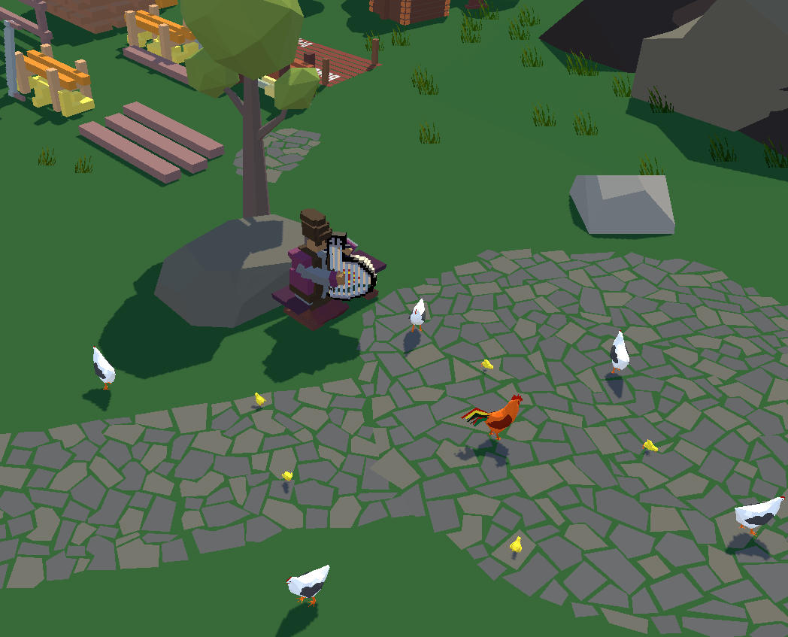
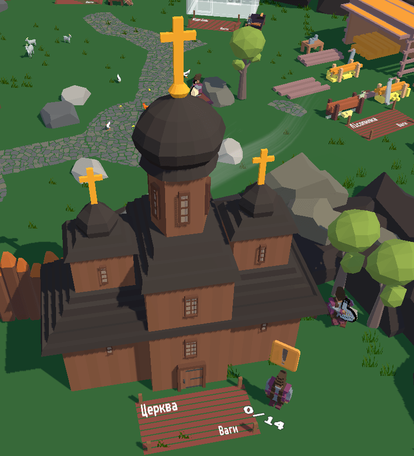
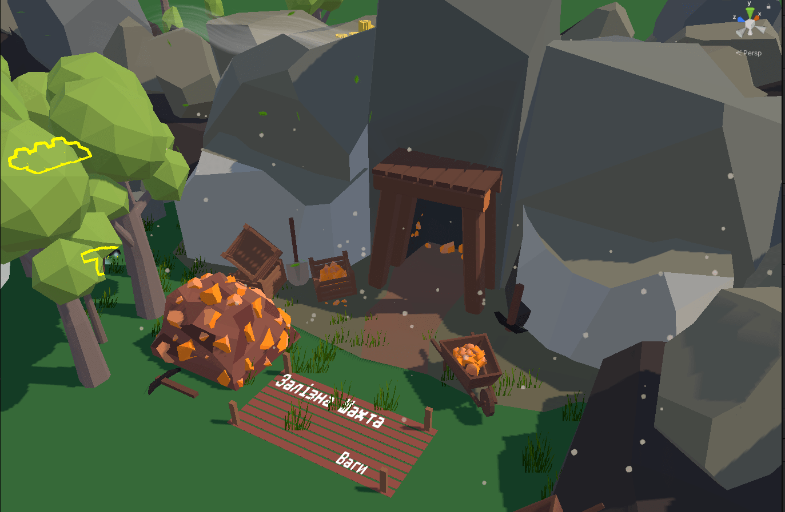
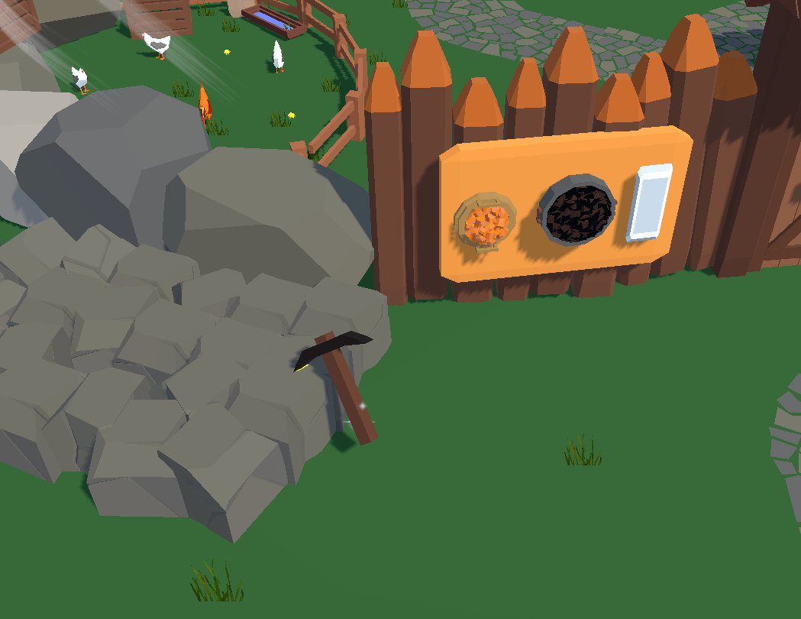
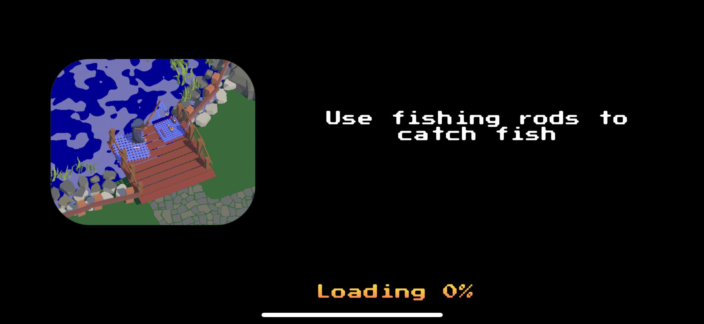
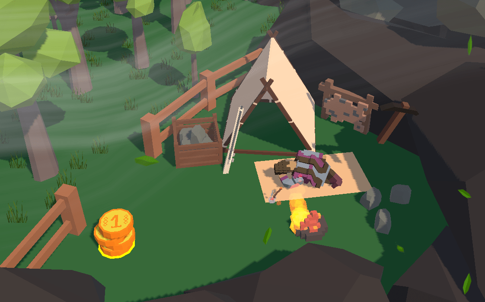
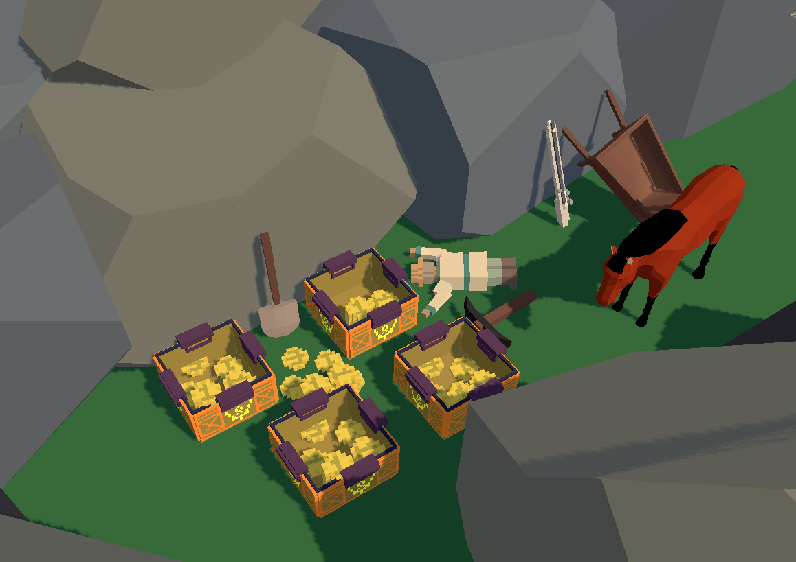

06-17 Sep
- New Kobzar (Musician) NPC with custom audio track

- New Church Lowpoly model

- New Iron Mine art for level 1, 2, 3:

- New axe lowpoly variant

- New loading screen with hints for players:

- Bundle size reduction: 75Mb -> 65.8Mb
- 🦟 Dozen bug fixes
- Added lots of tiny details to environment:

- Call sheriff...
