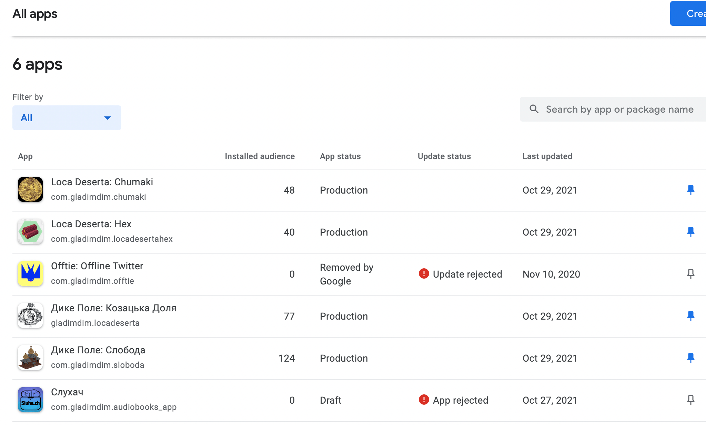
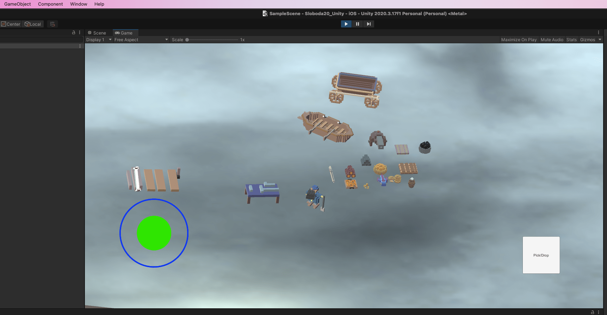

# Remake of Sloboda in Unity

Last time I checked stats of my games on Google Play was a month ago or so ⌛️.

[Sloboda](https://locadeserta.com/citybuilding) is still my #1 game.

By amount of effort put into it and by amount of features 😎

I plan to remake this game but this time instead of [Flutter 💙](https://flutter.dev) I will use Unity.

# Why Unity?

I spent a month learning and creating game with Unreal Engine. I found that blueprints is not for me.
Not even mentioning that C++ is also not for me :) Also the Engine has too many settings, ways of doing it and so on.

## So, why not Unreal Engine?

- Blueprints madness
- C++
- Too many settings for everything in Editor
- Terrible official tutorials
- Too few amateur tutorials
- Tooling that does not work (could not compile it for Android)
- Shaders compilations can take an hour

## I prefer Unity because:

- C#
- simpler editor
- AMAZING official Tutorials
- all questions answered on youtube by creator.
- Tooling that just works. Two clicks and I deployed app to Android and iOS devices in 2 minutes.

C#, on contra with C++, is the same as Dart. Which I love. Sometimes I even copy-paste code from Flutter into
Unity C# scripts and it requires only slight changes in order to compile.

## Progress report

My new game can already:

- upgrade/build buildings
- character movement with joytstick
- can pick/drop resources from floor
- can move resources

I plan to borrow gameplay mechanics from [Unrailed!](https://store.steampowered.com/app/1016920/Unrailed/)

### Where to get news?

I host a Telegram channel (Ukrainian): [Loca Deserta](https://t.me/locadesertachumaki). Тут постю постійно апдейти з відосами :)

You can also follow me on (Dmytro Gladkyi Twitter)[https://twitter.com/dmytrogladkyi].

